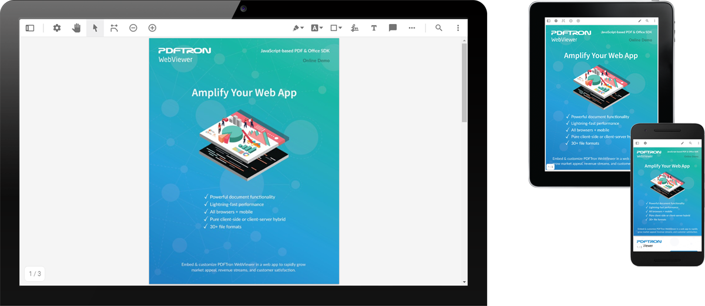

# WebViewer - Angular sample

[WebViewer](https://www.pdftron.com/webviewer) is a powerful JavaScript-based PDF Library that's part of the [PDFTron PDF SDK](https://www.pdftron.com). It provides a slick out-of-the-box responsive UI that interacts with the core library to view, annotate and manipulate PDFs that can be embedded into any web project.

This repo is specifically designed for any users interested in integrating WebViewer into Angular project. This project was generated with [Angular CLI](https://github.com/angular/angular-cli) version 7.0.3. See [Angular - Getting Started](https://angular.io/guide/quickstart) for more information.

## Initial setup

Before you begin, make sure your development environment includes [Node.js](https://nodejs.org/en/).

To work with this repo, you must [download the latest WebViewer](https://www.pdftron.com/documentation/web/guides/run-samples). Then, copy the files from `WebViewer/lib` folder and paste them to this project's `src/assets/webviewer` folder.

## Install

Run `npm install`.

## Run

Run `npm start` for a dev server. Navigate to `http://localhost:4200/`. The app will automatically reload if you change any of the source files.

## Build

Run `npm run build` to build the project. The build artifacts will be stored in the `dist/` directory. Use the `--prod` flag for a production build.

## API documentation

See [API documentation](https://www.pdftron.com/documentation/web/guides/ui/apis).

## Contributing

See [contributing](./CONTRIBUTING.md).

## License

See [license](./LICENSE).